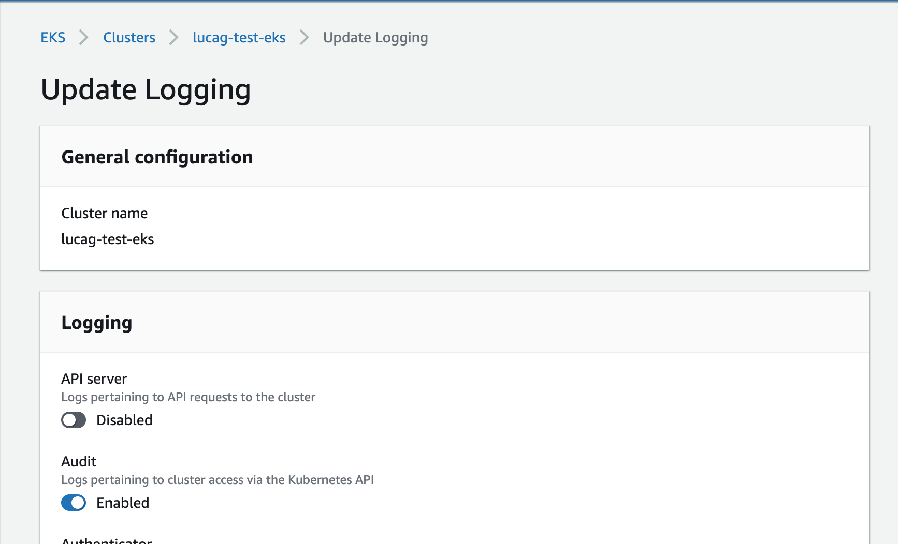
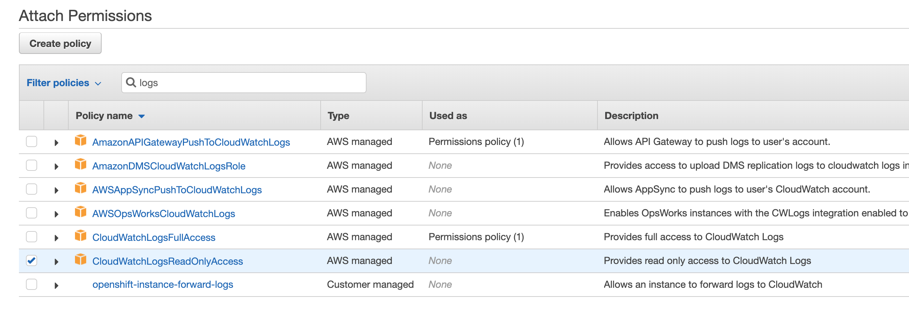

# EKS audit integration installation

## Prerequisites

In order to install the EKS integration you need an AWS EKS cluster which is currently monitored by Sysdig Secure.
The cluster needs to have the k8s audit service enabled, i.e. this must be present in your `dragent.yaml`:

```
    security:
      enabled: true
      k8s_audit_server_url: 0.0.0.0
      k8s_audit_server_port: 7765
    commandlines_capture:
      enabled: true
    memdump:
      enabled: true
```

In addition, the audit server must be exposed as a service:

```
apiVersion: v1
kind: Service
metadata:
  name: agent
  namespace: sysdig-agent
spec:
  type: ClusterIP
  ports:
  - name: audit
    port: 7765
    protocol: TCP
    targetPort: 7765
  selector:
    app: sysdig-agent
```

## EKS setup: enable CloudWatch audit logs

Your EKS cluster must be configured to forward audit logs to CloudWatch.
In order to do this from the AWS dashboard select your cluster > Logging > Update > Audit enabled



## EKS setup: configure the VPC endpoint

Your VPC must have an endpoint for the service `com.amazonaws.<your-region>.logs`, accessible from all the EKS security groups.
For example, in order to configure it from the AWS dashboard, go to VPCs, select Endpoints > Create Endpoints > Find service by name > `com.amazonaws.<your-region>.logs`. Under VPC select your VPC, and under security groups select all.

## EKS setup: configure EC2 instance profiles and roles

The EC2 instances that make up your EKS cluster must have the necessary permission to read CW logs. Usually they all use the same IAM Role, so that is the one to configure.
From the AWS EC2 dashboard select the interface, go to its associated IAM Role and Attach the policy *CloudWatchLogsReadOnlyAccess*.



## Deploy the client and its configmap

```
$ kubectl --namespace sysdig-agent apply -f ./ekscloudwatch-config.yaml
configmap/ekscloudwatch-config created
$ kubectl --namespace sysdig-agent apply -f ./deployment.yaml
deployment.apps/eks-cloudwatch created
```
